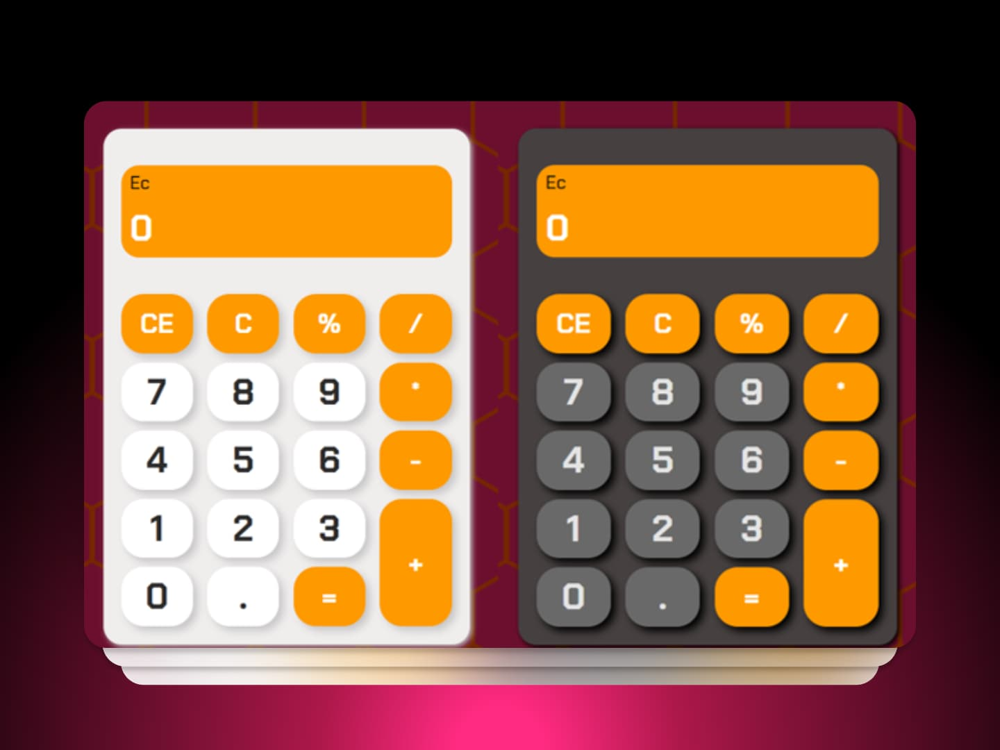

# Calculadora simple 

Esta es una calculadora simple, que realiza operaciones aritméticas básicas como adición, sustracción, producto, división e incluso el módulo.

## Instalación

Puedes clonar el repositorio o descargar el archivo ZIP del proyecto.

1. **Clonar el repositorio:**
  ```bash
    git clone https://github.com/tu_usuario/tu_repositorio.git
  ```

2. **Descargar el archivo ZIP:**
   [Descargar ZIP](https://github.com/Usuario6842/calculadora-simple/archive/refs/heads/main.zip)

### Demostración
<a href="https://alementary-calculator.pages.dev" target="_blank"><strong>🚀Live Demo</strong></a>

## Vista Previa
<div align="center">
  
</div>

### ¡Gracias por tu interés!

¡Espero que lo disfrutes. Si tienes alguna duda o sugerencia, no dudes en contactarme. 💚💚💚

